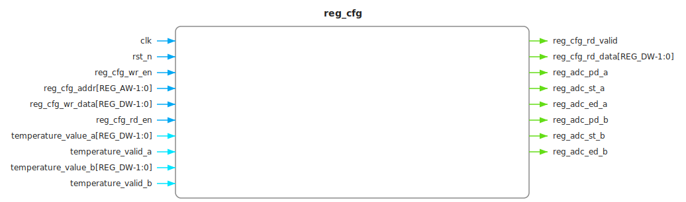
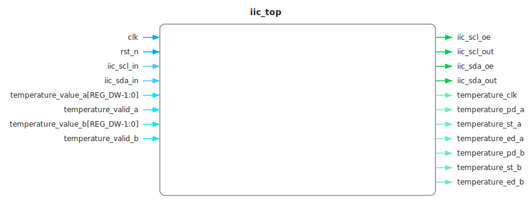
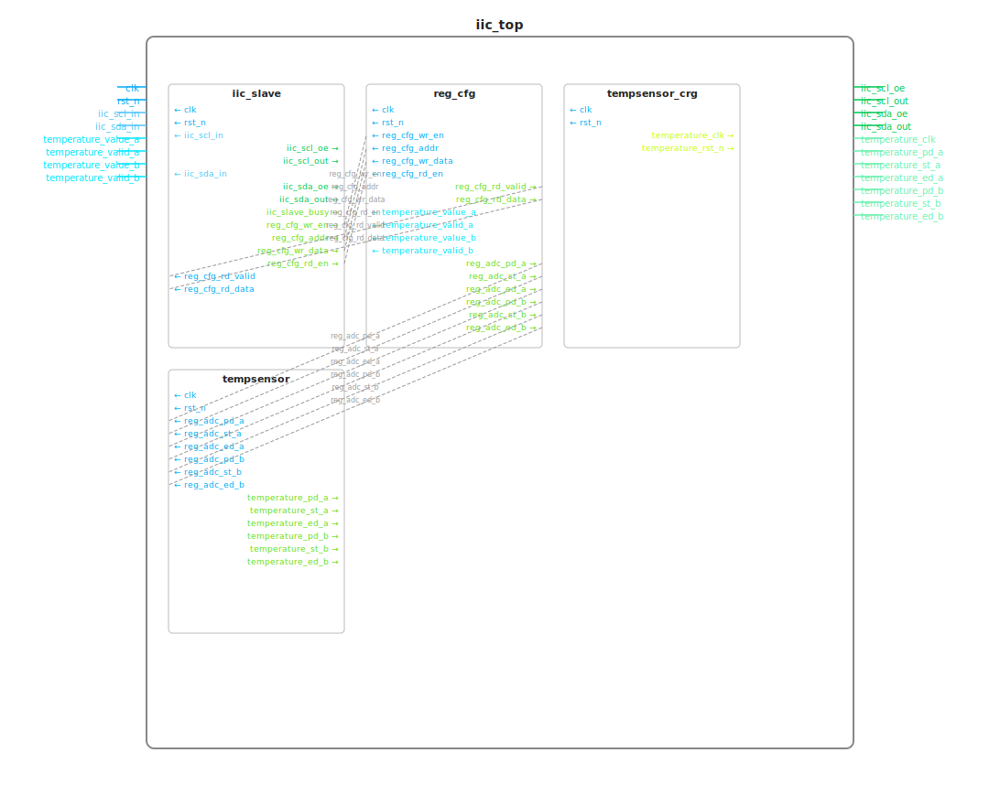

# excel2design

> 从 Excel 模块端口表 → (HTML / SVG / Excalidraw) 框图 + Verilog wrapper + 多文件工程的自动化工具集

[](https://www.python.org)
[](#)
[](#)
[](#)

---

## 这是什么

数字IC工程师通常在 Excel 里维护模块端口表（端口名、方向、位宽、寄存器类型、复位行为等）。
`excel2design` 读取这份 Excel，一键生成：

1. **3 种独立框图**（每个模块）
   - **HTML**（浅色主题，CSS 变量 + Flexbox 响应式，可在浏览器缩放/打印）
   - **SVG**（矢量，ElementTree 构造，可嵌入 PPT/Word）
   - **Excalidraw**（手绘风，固定 seed 字节稳定，可在 [app.excalidraw.com](https://app.excalidraw.com) 继续编辑）
2. **2 种层次化框图**（整工程）
   - **层次化 SVG**（嵌套矩形 + wrapper↔sub 内部连线）
   - **层次化 Excalidraw**（手绘风嵌套 + 信号名 label）
3. **Verilog wrapper 骨架**
   - 端口声明（6 列对齐：direction / signed / type / width / name / comma）
   - parameter 注入（带位宽，`)`/`,` 与 port 行同列）
   - 内部 wire 声明（带子模块间连接注释）
   - 子模块实例化（自动连接 + 模糊匹配 + TODO 标记未匹配端口）
   - `initial` 块（带 default 的 reg）
   - 多 (clock, reset_type) always 块（按二元组分块）
4. **多文件工程**（`excel2design project`）
   - `rtl/*.v`（每个模块独立文件）
   - `define/*.vh`（`@defines` sheet 解析的宏定义）
   - `filelist/*.f`（BFS 顺序的编译文件列表）
   - `doc/*.{html,svg,excalidraw}`（3 格式 × N 模块 + 2 层次图）

所有产出以 Excel 为**单一事实源** — 改 Excel 重跑即可，框图和 wrapper 永远对齐。

---

## 安装

```bash
git clone <repo-url>
cd excel2design
python -m venv .venv
.venv/bin/pip install -e .
```

需要 Python 3.10+。可选 dev 依赖：

```bash
.venv/bin/pip install -e ".[dev]"
```

---

## 快速开始

### 单模块（v0.3+ 基础用法）

```bash
# 1. 准备 Excel — 每个 sheet = 一个模块
# 样例见 examples/sample_module_iic_top.xlsx（v0.5 默认样例，7 模块 / 3 级层次）

# 2. 解析概览
$ excel2design parse examples/sample_module_iic_top.xlsx
Module: iic_top      (sheet: iic_top)         — 18 ports, 2 params
Module: iic_slave    (sheet: iic_slave)        — 13 ports, 2 params
Module: reg_cfg      (sheet: reg_cfg)          —  7 ports, 2 params
Module: tempsensor   (sheet: tempsensor)       —  4 ports, 0 params
Module: tempsensor_crg (sheet: tempsensor_crg) —  3 ports, 1 param
Module: adc_a        (sheet: adc_a)            —  3 ports, 2 params
Module: adc_b        (sheet: adc_b)            —  3 ports, 2 params

# 3. 生成单模块的 3 种框图
$ excel2design diagram examples/sample_module_iic_top.xlsx reg_cfg --output output/
Wrote output/reg_cfg.html
Wrote output/reg_cfg.svg
Wrote output/reg_cfg.excalidraw
```

**示例框图（reg_cfg，SVG 矢量）**：
<picture>
  
</picture>

### 整工程（一键多文件）— v0.5 新增

```bash
$ excel2design project examples/sample_module_iic_top.xlsx -o output/
Generated 32 files in output/

$ tree output/iic_top
output/iic_top/
├── define/
│   └── iic_top.vh              # `define ADC_EN 32 / `define ADC_PD_MODE 32
├── filelist/
│   └── iic_top.f               # 编译文件列表（BFS 顺序）
├── rtl/
│   ├── iic_top.v               # 顶层（实例化所有 sub-module）
│   ├── iic_slave.v
│   ├── reg_cfg.v
│   ├── tempsensor.v
│   ├── tempsensor_crg.v
│   ├── adc_a.v
│   └── adc_b.v
└── doc/
    ├── iic_top.html / .svg / .excalidraw          # 顶层独立框图
    ├── iic_slave.html / .svg / .excalidraw
    ├── reg_cfg.html / .svg / .excalidraw
    ├── tempsensor.html / .svg / .excalidraw
    ├── tempsensor_crg.html / .svg / .excalidraw
    ├── adc_a.html / .svg / .excalidraw
    ├── adc_b.html / .svg / .excalidraw
    ├── iic_top_hierarchy.svg                      # 层次化 SVG（嵌套 + 连线）
    └── iic_top_hierarchy.excalidraw               # 层次化 Excalidraw
```

**顶层 iic_top 框图（SVG 矢量，18 端口 + 时钟域分色）**：
<picture>
  
</picture>

**层次化 iic_top（嵌套矩形 + wrapper↔sub 连线）**：
<picture>
  
</picture>

> 注：HTML 版本（带交互）和 Excalidraw 版本（手绘风）需在浏览器里查看 — 跑 `excel2design project` 后用 `xdg-open output/iic_top/doc/iic_top.html` 或导入 Excalidraw 文件。

### Verilog wrapper 样例（v0.5 层次化 + 列对齐）

`output/iic_top/rtl/iic_top.v` 头部（部分）：

```verilog
module iic_top #(
    parameter REG_AW = 32,
    parameter REG_DW = 32
) (
    // ---------- INPUTS ----------
    input  wire                     clk                ,
    input  wire                     rst_n              ,
    input  wire        [REG_DW-1:0] temperature_value_a,
    input  wire signed [REG_DW-1:0] temperature_value_b,
    // ---------- OUTPUTS ----------
    output wire                     iic_scl_oe         ,
    output wire         [REG_DW-1:0] temperature_pd_a  ,
    ...
);

// ---------- INTERNAL WIRES ----------
wire              reg_cfg_wr_en    ;  // iic_slave → reg_cfg
wire [REG_AW-1:0] reg_cfg_addr     ;  // iic_slave → reg_cfg
wire [REG_DW-1:0] reg_cfg_wr_data  ;  // iic_slave → reg_cfg
...

// ---------- SUB-MODULES ----------

iic_slave #(
    .REG_AW            (REG_AW          ) ,
    .REG_DW            (REG_DW          )
) iic_slave (
    .clk               (clk             ) ,
    .rst_n             (rst_n           ) ,
    .iic_scl_in        (iic_scl_in      ) ,
    .iic_slave_busy    (                ) ,  // TODO: no matching port
    .reg_cfg_wr_en     (reg_cfg_wr_en   ) ,
    ...
);
```

**关键特性**：
- 6 列端口对齐（`direction(7)` / `signed(7)` / `type(5)` / `width(max)` / `name(max)` / comma）
- 内部 wire 带连接注释（`// iic_slave → reg_cfg`）
- 实例参数 + 实例端口**统一风格**（`name` / `(value)` / `,` 三列，param 的 `)`/`,` 与 port 行严格同列 — SPEC §17.6）
- 未匹配端口自动标 `TODO: no matching port`

---

## Excel 模板规范

### 两段式布局（每个 sheet）

```
# === PARAMETERS ===
name            | value | width | param_type | comment
DATA_WIDTH      | 8     | 32    | parameter  | 数据位宽
FIFO_DEPTH      | 16    | 32    | parameter  | FIFO 深度

# === PORTS ===
name        | direction | width      | type | default                     | clock | reset_type | signed | interface | comment
clk         | input     | 1          | wire |                             |       |            | 0      | 0         | 系统时钟
rst_n       | input     | 1          | wire |                             |       |            | 0      | 0         | 异步低有效复位
rx_data     | output    | DATA_WIDTH | reg  | {DATA_WIDTH{1'b0}}          | clk   | async      | 0      | 0         | 接收数据
rx_valid    | output    | 1          | reg  | 1'b0                        | clk   | async      | 0      | 0         | 接收有效
```

### Parameter 段（5 列）

| 列 | 字段 | 必填 | 缺省 | 说明 |
|---|---|---|---|---|
| A | `name` | ✅ | — | parameter 名 |
| B | `value` | ✅ | — | 默认值 |
| C | `width` | ❌ | 空 | 位宽（整数，如 `32`） |
| D | `param_type` | ❌ | `parameter` | `parameter` / `localparam` |
| E | `comment` | ❌ | 空 | 说明 |

### Port 段（10 列）

| 列 | 字段 | 必填 | 缺省 | 说明 |
|---|---|---|---|---|
| A | `name` | ✅ | — | 端口名 |
| B | `direction` | ✅ | — | `input` / `output` / `inout` |
| C | `width` | ❌ | `1` | 位宽或表达式（`DATA_WIDTH` / `DATA_WIDTH*2`） |
| D | `type` | ❌ | 见下 | `wire` / `reg` / `logic` |
| E | `default` | ❌ | 空 | reg reset 默认值（`1'b0` / `8'hFF` / `{N{1'b0}}`） |
| F | `clock` | ❌ | 空 | 关联时钟 |
| G | `reset_type` | ❌ | `sync` | `sync` / `async` / `none` |
| H | `signed` | ❌ | `0` | `1` = signed 端口 |
| I | `interface` | ❌ | `0` | `1` = interface 风格（v0.3 仅记录） |
| J | `comment` | ❌ | 空 | 端口说明 |

**`type` 缺省推断**：
- `output` + 无 type → `reg`
- `input` + 无 type → `wire`
- `inout` + 无 type → `wire`

**`reset_type` 语义**：
- `sync` — 同步复位（`always @(posedge clk)`）
- `async` — 异步复位（`always @(posedge clk or negedge rst_n)`）
- `none` — 无复位（不生成 always 块，但仍生成 initial 块如有 default）

### 层次化约定（v0.5 新增）

#### Sheet 命名 — 父子关系用 `.` 分隔

```
iic_top                    # 顶层（无 .）
iic_top.iic_slave          # iic_top 的子模块 iic_slave
iic_top.reg_cfg            # iic_top 的子模块 reg_cfg
iic_top.tempsensor_crg     # iic_top 的子模块 tempsensor_crg
iic_top.tempsensor_crg.adc_a  # 三级嵌套
```

实例名 = sheet 名的**最后一段**（`iic_slave` / `reg_cfg` / `adc_a`）。

#### `@defines` sheet — 全局宏定义

在 workbook 任意位置加一个 sheet 命名为 `@defines`：

```
# === DEFINES ===
name          | value | comment
ADC_EN        | 32    | ADC 通道使能位宽
ADC_PD_MODE   | 32    | ADC power-down 模式
```

自动生成 `define/iic_top.vh`：
```verilog
`define ADC_EN      32
`define ADC_PD_MODE 32
```

#### 同名端口处理 — 用 `_a` / `_b` 后缀

子模块有多个实例（如 `adc_a` / `adc_b`）时，端口加后缀区分。wrapper 自动模糊匹配：

```verilog
// 实例化时自动消除歧义
adc_a adc_a (
    .temperature_value_a (temperature_value_a),
    .temperature_valid_a (temperature_valid_a),
    ...
);
adc_b adc_b (
    .temperature_value_b (temperature_value_b),
    .temperature_valid_b (temperature_valid_b),
    ...
);
```

详细规范见 [`docs/SPEC.md`](docs/SPEC.md)。

---

## 作为 Python 库使用

### 单模块 API（v0.3+）

```python
from pathlib import Path
from excel2design import parse_workbook, get_module
from excel2design.generators.diagram_html import generate_html
from excel2design.generators.diagram_svg import generate_svg
from excel2design.generators.diagram_excalidraw import generate_excalidraw
from excel2design.generators.verilog import generate_wrapper

# 解析
modules = parse_workbook(Path("examples/sample_module_iic_top.xlsx"))
module = get_module(modules, "reg_cfg")

# 框图
Path("out/reg_cfg.html").write_text(generate_html(module), encoding="utf-8", newline="\n")
Path("out/reg_cfg.svg").write_text(generate_svg(module), encoding="utf-8", newline="\n")
Path("out/reg_cfg.excalidraw").write_text(generate_excalidraw(module), encoding="utf-8", newline="\n")

# Wrapper
Path("out/reg_cfg.v").write_text(
    generate_wrapper(module, source_file="examples/sample_module_iic_top.xlsx", source_sheet="reg_cfg"),
    encoding="utf-8", newline="\n",
)
```

### 工程 API（v0.5 新增）

```python
from pathlib import Path
from excel2design.parsers.hierarchy import parse_project
from excel2design.generators.project_output import generate_all

project = parse_project(Path("examples/sample_module_iic_top.xlsx"))
generate_all(project, output_root=Path("output/"))  # 一键多文件
```

---

## CLI 命令

```bash
excel2design parse <excel> [--json]
    # 解析并打印所有模块/参数概览，--json 输出 JSON

excel2design diagram <excel> [MODULE_NAME]
    [--format {html,svg,excalidraw,all}]   # 默认 all
    [--all]                                 # 批量生成所有模块
    [-o, --output <dir>]                    # 默认 ./output

excel2design wrapper <excel> <module>
    [-o, --output <file>]                   # 默认 ./<module>.v

excel2design all <excel> <module>
    # = diagram + wrapper 一起生成（单模块）
    [-o, --output <dir>]                    # 默认 ./output

excel2design project <excel> -o <dir>      # ← v0.5 新增
    # 一键多文件工程：rtl/*.v + define/*.vh + filelist/*.f + doc/*
```

**退出码**（SPEC §6）：
- `0` — 成功
- `2` — Excel 文件不存在
- `3` — 模块（sheet）不存在
- `4` — 解析错误（marker 缺失 / 表头错 / 端口重名等）

---

## 路线图（全部完成 ✅）

| Phase | 目标 | 状态 | commit |
|---|---|---|---|
| 0 | 项目骨架 + Excel 样例 + CI | ✅ | `ebd0054` |
| 1 | 数据模型 + Excel 解析器（136 tests） | ✅ | `c152dd7` |
| 1.5 | Golden baseline 框架（4 fixture + 5 tests） | ✅ | `e392f8b` |
| 2 | HTML 框图（17 tests via subagent） | ✅ | `435503d` |
| 3 | SVG 框图（8 tests via subagent） | ✅ | `fd29900` |
| 4 | Excalidraw 框图（8 tests via subagent） | ✅ | `6db2c6f` |
| 5 | Verilog wrapper（23 tests） | ✅ | `d9419ae` |
| 6 | CLI + e2e tests（14 tests） | ✅ | `e484a3a` |
| 7 | `@defines` 解析 + `.vh` / `.f` 生成 | ✅ | `11936ed` |
| 8 | 层次解析器 + `Project` 数据模型 | ✅ | `11936ed` |
| 9a | 实例化连接算法（模糊匹配 + 内部 wire） | ✅ | `11936ed` |
| 9b | Verilog 实例化模板（6 列对齐） | ✅ | `7e0f3b2` |
| 9c | 多文件输出 + CLI `project` | ✅ | `d90fdd6` |
| 10a | 独立框图批量模式（`diagram --all`） | ✅ | `d90fdd6` |
| 10b | 层次化 SVG 框图 | ✅ | `34c65ea` |
| 10c | 层次化 Excalidraw 框图 | ✅ | `5cf988c` |
| 11 | 集成测试 + hierarchy_2level baseline | ✅ | `7b7e15b` |

**总计：226 个测试 100% 通过**

详细见 [docs/SPEC.md](docs/SPEC.md)、[docs/CHANGELOG.md](docs/CHANGELOG.md)、[docs/TASKS.md](docs/TASKS.md)。

---

## 技术栈

- **Excel 解析**：[openpyxl](https://openpyxl.readthedocs.io/) ≥ 3.1
- **模板引擎**：[Jinja2](https://jinja.palletsprojects.com/) ≥ 3.1
- **CLI**：[click](https://click.palletsprojects.com/) ≥ 8.1
- **测试**：[pytest](https://docs.pytest.org/) ≥ 7.4

---

## 项目结构

```
excel2design/
├── README.md
├── LICENSE
├── pyproject.toml
├── docs/
│   ├── SPEC.md                           ← 详细设计规格书（v0.5.2, 17 章）
│   ├── TASKS.md                          ← 实时任务追踪
│   ├── CHANGELOG.md                      ← 用户视角 changelog
│   ├── SUBAGENT_LOG.md                   ← subagent 详细记录
│   ├── REVIEW.md / REVIEW_v2.md / REVIEW_v3.md  ← 验收报告
│   └── screenshots/                      ← README 引用图（SVG 矢量）
├── excel2design/                         ← 源码
│   ├── core/
│   │   ├── models.py                     # Port/Parameter/Module/Define/Project + 5 enums
│   │   └── exceptions.py                 # 12 个异常类（3 层分类）
│   ├── parsers/
│   │   ├── excel.py                      # 完整解析器（marker + 两段式 + 11 种错误检测）
│   │   ├── hierarchy.py                  # v0.5: 层次解析 + Project 构建
│   │   ├── width.py                      # 位宽解析（固定/参数/表达式）
│   │   └── default.py                    # default 字面量规则
│   ├── utils/
│   │   ├── cell.py                       # cell_to_str（类型白名单）
│   │   ├── identifier.py                 # VERILOG_KEYWORDS（80+ 保留字）
│   │   └── clock_colors.py               # v0.3.4: 时钟域分色
│   ├── generators/
│   │   ├── diagram_html.py               # HTML 框图（Jinja2 + CSS 变量）
│   │   ├── diagram_svg.py                # SVG 框图（ElementTree）
│   │   ├── diagram_excalidraw.py         # Excalidraw（dict + json.dumps）
│   │   ├── diagram_svg_hierarchy.py      # v0.5: 层次化 SVG
│   │   ├── diagram_excalidraw_hierarchy.py  # v0.5: 层次化 Excalidraw
│   │   ├── verilog.py                    # Verilog wrapper（多 clock always 分块 + 实例化）
│   │   └── project_output.py             # v0.5: 多文件编排器
│   ├── templates/
│   │   ├── diagram_html.j2
│   │   ├── partial_port.j2
│   │   ├── verilog_wrapper.j2
│   │   ├── partial_always.j2
│   │   └── partial_instance.j2           # v0.5: 实例化子模板
│   └── cli.py                            # click CLI（parse/diagram/wrapper/all/project）
├── tools/
│   ├── gen_sample.py                     # 样例生成
│   ├── gen_fixtures.py                   # 测试 fixture
│   └── gen_baseline.py                   # JSON baseline
├── examples/
│   └── sample_module_iic_top.xlsx        # v0.5 默认样例（7 模块 / 3 级层次）
├── tests/                                # 8 层测试
│   ├── unit/                             # 解析器/工具单测
│   ├── generators/                       # 生成器单测
│   ├── e2e/                              # CLI 端到端
│   ├── fixtures/                         # fixture + JSON baseline
│   ├── test_golden.py                    # 字节级回归
│   └── test_smoke.py                     # 入口冒烟
└── .github/workflows/ci.yml              # GitHub Actions（py3.10/3.11/3.12）
```

---

## 关键设计原则

### 字节稳定（SPEC §5.7）
- **时间戳可控**（默认不写，开启时支持 `SOURCE_DATE_EPOCH`）
- **行尾固定 LF**，无 trailing whitespace
- **端口严格按 Excel 顺序**
- **Jinja2 模板禁用 random / timestamp**
- **多次生成输出字节完全一致**（golden test 验证）

### 异常三层分类（SPEC §3.4）
- `ExcelParseError` — 物理层：cell 类型、列缺失、marker 缺失
- `SemanticError` — 逻辑层：端口重名、identifier 非法、width 表达式含未声明 param
- `RenderError` — 生成层：模板失败、坐标越界

每个异常带 `row, col, sheet, suggestion` 字段，CLI 渲染为：
```
ERROR [sheet: uart_rx, row 8, col 3] 位宽 "8 bits" 既不是数字也不是表达式
       ↳ 建议：width 列应填纯数字（如 8）或 parameter 名（如 DATA_WIDTH）
```

### 多时钟域 always 分组（SPEC §3.5.6）
- 分块键：`(clock, reset_type)` 二元组
- 同 (clock, reset_type) → 1 个 always 块
- 块间顺序：先按 clock 名 ASCII，再按 reset_type（async → none → sync）

### 层次化实例化（SPEC §17，v0.5 新增）
- **三级端口匹配**：parent port → sibling port → parent param
- **模糊后缀匹配**：同名 + 数字后缀（`adc_a` ↔ `adc_b`）自动消除歧义
- **6 列严格对齐**（param + port + instance port/param 全部统一风格）
- **内部 wire 推导**：从连接关系反推 wire 列表（不再单独扫描）
- **BFS 输出顺序**：保证 `filelist/*.f` 编译顺序稳定

---

## 不在范围（v0.5）

- ❌ 不生成任何功能性 RTL 逻辑（只生成复位 always 块）
- ❌ 不解析已有 Verilog 文件反向生成 Excel
- ❌ 不支持 Excel 公式、合并单元格、跨 sheet 引用
- ❌ 不做 lint、CDC 检查、综合
- ❌ 不支持 SystemVerilog interface/class
- ❌ `interface=1` 标记仅记录，不做特殊处理（v0.6+）

---

## 贡献

待补充。

---

## License

MIT
